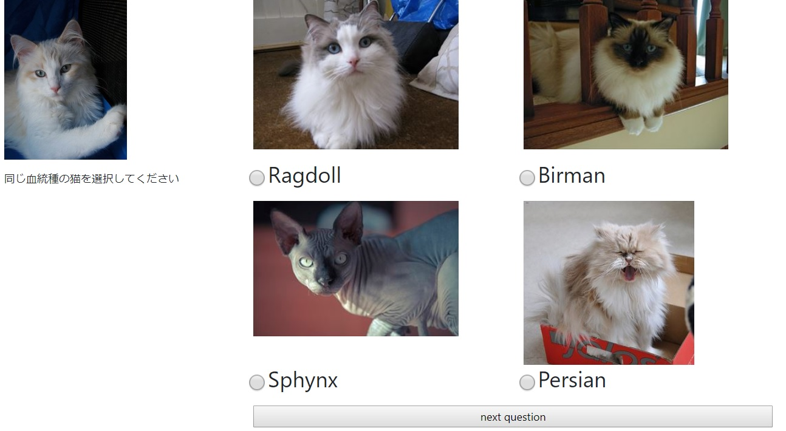

# 実験計画書

## 名称

ワーカーの振る舞いによる低品質ワーカーの検出

## 分類

集める

- データを集めてそこから低品質ワーカーの解析を行うという点でいえばクラウドソーシングはあくまでデータを集める手段なので集める

## 背景

クラウドソーシングでデータを集める際に多くの場合考えなくてはいけないこととして、ワーカーの品質が保証できないこと、それによってどのように低品質ワーカーを検出し省くかを考えなくてはいけない。検出方法について既存のものであれば、多数決やgold setなど回答した結果から検出する方法があるが、回答から検出しようとするとそれが適当にやったのか、本当に間違えただけかを考慮できない。そこで回答ではなく、回答中のワーカーのふるまい方に注目して低品質ワーカーの検出ができるかどうかに興味を持ったため今研究を行う

## 仮説

回答する際のマウスの動きを極座標で考える。このとき、真剣に答える人は一様分布になり、逆に適当に答えたなら偏った分布になるとと仮定する。分布の差を用いることによって低品質ワーカーの検出を行うことができる。

## 目的

今実験の目的は2つ

- 高品質ワーカー、低品質ワーカーのマウスの動きに差があるか検証
- (実際にマウスの動きで検出が行えるか実証する)

## 方法

- 対象 : 条件指定なしで200人を目標とする。50人単位で細かくタスクを発行する。
- 料金 : 2160円
- 実施場所 : ヤフークラウドソーシング
- 手続き : 低品質ワーカーの検出には既存の方法のゴールドセットの技法で行う。
- タスク : 猫の血統種のタグ付け
- 用いるデータ : 猫の画像データ
- 実験サンプル

## 得られる結果

低品質ワーカーの検出の新たな提案

## 評価方法

分類気を作成、検証

## 人権配慮

とくになし(制限なし)

## データ保管の方法

ハードディスク、10年間保管

## 関連研究

- Aroyo, Lora and Welty, Chris. Crowd Truth: Harnessing disagreement in crowdsourcing a relation extraction gold standard. WebSci2013. ACM. 2013.
- Rzeszotarski, Jeffrey M and Kittur, Aniket. "Instrumenting the crowd: using implicit behavioral measures to predict task performance". Proceedings of the 24th annual ACM symposium on User interface software and technology. ACM, 2011, p.13-22.
- Oleson, David and Sorokin, Alexander and Laughlin, Greg P and Hester, Vaughn and Le, John and Biewald, Lukas. Programmatic Gold: Targeted and Scalable Quality Assurance in Crowdsourcing. Human computation. 2011, 11(11).
- 松田義貴，鈴木優，中村哲 タスク介入によるクラウドワーカの品質推定精度の改善 第10回データ工学と情報マネジメントに関するフォーラム (DEIM2018), Mar. 2018